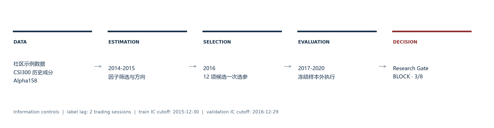
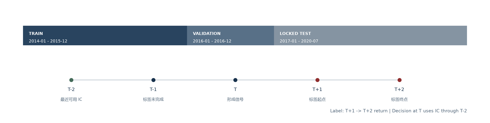
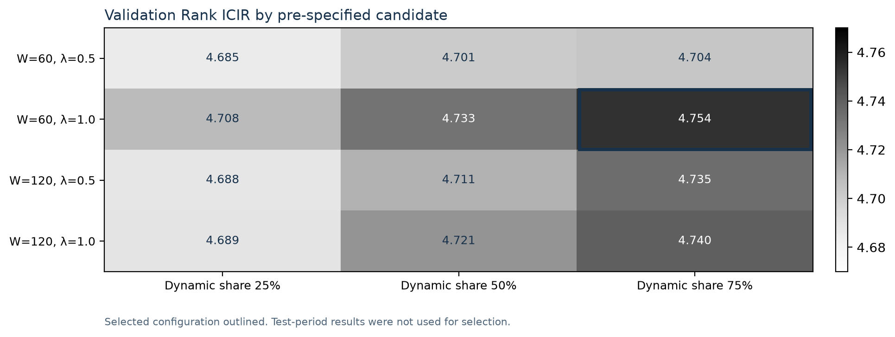
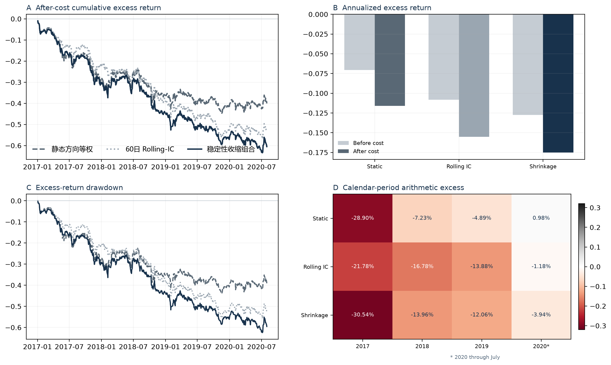

# Qlib Factor Robustness Lab

> 一套独立构建的量化研究验证与模型风险治理系统：以 Qlib 作为标准化数据、特征和执行基础设施，核心实现覆盖标签时序控制、因子稳定性建模、冻结样本外评估与机器研究 Gate。

[在线研究备忘录](https://yihan498.github.io/qlib-factor-robustness-lab/) · [5 页打印报告](output/pdf/quant-research-note-v4.pdf) · [机器结果](evidence/v2_verified_results.json) · [独立 Grill 审计](reports/v4/grill-audit.md) · [v5 生成清单](evidence/v5_showcase_manifest.json)

## Executive decision

项目包含两条相互独立的证据链：

| 证据链 | 目的 | 核心结果 | 可得结论 |
|---|---|---:|---|
| 项目研究主线：稳定性加权评估 | 验证时间治理、参数选择、组合执行和研究 Gate | Rank IC 0.01221；成本后年化超额 -17.50% | 未达到研究晋级标准 |
| 基础设施标定：标准参考工作流 | 确认 Alpha158、LightGBM 与 Qlib 执行环境 | Rank IC 0.04963；成本后年化超额 9.56% | 运行环境通过标定 |

Qlib 是项目采用的研究基础设施，不是被修改后重新包装的作品；项目未改动 Qlib 上游源码。标准参考工作流只承担环境标定作用，项目研究主线必须由自身的两个对照和冻结测试结果接受评价，两者不能被解释为同一策略的“改进前后”。

**最终状态：研究晋级 Gate = BLOCK，8 项检查中 3 项通过。**

稳定性信号虽然具有正截面相关性，但成本后收益、信息比率、最大回撤及相对对照优势均不满足预设条件，因此系统拒绝将其称为策略改进。项目的核心输出是可审计的研究决策，而不是收益承诺。

## 1. System scope

系统覆盖量化研究的四个层级：

1. **数据与特征**：社区 Qlib 示例数据、CSI300 历史成分、Alpha158 特征与标签；
2. **研究与选择**：训练期因子筛选、标签信息滞后、验证期候选参数治理；
3. **组合与执行**：三类截面信号、Top50/Drop5 组合、涨跌停与双边交易成本；
4. **治理与证据**：冻结测试期、机器可读 Gate、配置哈希、单元测试和版本化展示。

数据证据覆盖 479,497 行、546 个历史成分证券和 868 个测试标签日。运行环境锁定为 Python 3.12.13、pyqlib 0.9.7 与 LightGBM 4.7.0。

## 2. Research protocol

| 阶段 | 区间 | 用途 | 测试期是否可见 |
|---|---|---|---|
| 训练 | 2014-01 — 2015-12 | 筛选 30 个因子、确定静态方向 | 否 |
| 验证 | 2016-01 — 2016-12 | 在 12 个候选配置中一次选参 | 否 |
| 测试 | 2017-01 — 2020-07 | 冻结参数后的最终评估 | 仅最终运行 |

Alpha158 标签定义为 T+1 到 T+2 收益。T 日标签直到 T+2 才完整可观测，因此 T 日权重只能使用截至 T-2 已实现的 IC。项目使用交易日索引而非自然日进行两期滞后和边界 purge：

- 训练声明截止 2015-12-31，有效 IC 截止 2015-12-30；
- 验证声明截止 2016-12-31，有效 IC 截止 2016-12-29；
- 春节等非交易日不会被误当作信息期。

## 3. Method definition

每日因子质量使用截面 Rank IC：

\[
IC_{j,t}=Spearman(F_{j,t},R_{t+1\rightarrow t+2})
\]

稳定性调整权重使用滞后 IC 的滚动均值，并扣除估计标准误：

\[
\widetilde{w}_{j,t}=sign(\mu_{j,t})\cdot
max\left(|\mu_{j,t}|-\lambda\frac{\sigma_{j,t}}{\sqrt{n_{j,t}}},0\right)
\]

动态权重随后与训练期固定方向按验证期确定的比例收缩，并使每日绝对权重和为 1。三类对照方案为静态方向等权、60 日 Rolling-IC 和稳定性收缩组合。

候选空间包含 2 个滚动窗口、2 个不确定性惩罚和 3 个动态权重占比，共 12 项。验证期按年化 Rank ICIR 选择 window=60、penalty=1.0、dynamic share=75%；测试期不再调参。

## 4. Execution assumptions

| 约束 | 设置 |
|---|---:|
| 股票池 / 基准 | CSI300 历史成分 / SH000300 |
| 目标持仓 / 每日替换 | Top 50 / 最多 5 只 |
| 买入 / 卖出成本 | 5 bp / 15 bp |
| 涨跌停阈值 | 9.5% |
| 最低费用 | 5 元 |

Qlib 的 TopkDropoutStrategy 与 SimulatorExecutor 统一处理持仓变更、不可交易状态、换手和成本。项目正式实验不使用简化名单换手模型作为证据。

## 5. Out-of-sample evidence

| 项目研究方案 | Rank IC | ICIR | 成本前超额 | 成本后超额 | 成本后 IR | 最大回撤 | 平均换手 |
|---|---:|---:|---:|---:|---:|---:|---:|
| 静态方向等权 | 0.02251 | 1.881 | -7.06% | -11.59% | -1.056 | -43.69% | 0.180 |
| 60 日 Rolling-IC | 0.00849 | 0.736 | -10.82% | -15.52% | -1.575 | -55.65% | 0.187 |
| 稳定性收缩组合 | 0.01221 | 1.093 | -12.75% | -17.50% | -1.738 | -62.44% | 0.189 |

### Failure diagnosis

- 三组方案均具有正 Rank IC，但组合端持续落后于基准，全截面排序指标不能替代尾部 Top50 的执行验证；
- 成本造成约 4.5–4.8 个百分点的年化侵蚀，但三组方案在成本前已经为负，手续费不是唯一原因；
- 稳定性收缩组合相对静态对照具有更低的成本前收益、更高换手和更深回撤，动态估计在该样本中增加了噪声与组合不稳定性；
- 失败链条更可能同时涉及尾部选股质量、行业/规模暴露、组合集中与信号衰减。

年度分段采用每日成本后超额的算术累加，不是复合收益。IC 显著性尚未对序列相关和多重检验作校正，因此不将名义 ICIR 解释为已验证的经济显著性。

## 6. Machine-readable research Gate

Gate 只回答“是否进入更高保真研究阶段”，不等同于生产或实盘批准。阈值在 YAML 中固定，最终页面读取运行结果，不硬编码决策。

| 检查项 | 观测值 | 阈值 | 结果 |
|---|---:|---:|---|
| 测试标签日 | 868 | ≥ 500 | PASS |
| Rank IC | 0.012 | ≥ 0.000 | PASS |
| 年化 Rank ICIR | 1.093 | ≥ 0.500 | PASS |
| 成本后年化超额 | -17.50% | ≥ 0.00% | FAIL |
| 成本后信息比率 | -1.738 | ≥ 0.000 | FAIL |
| 最大回撤 | -62.44% | ≥ -30.00% | FAIL |
| 相对最佳对照收益优势 | -5.92% | ≥ 0.00% | FAIL |
| 相对最佳对照 IR 优势 | -0.682 | ≥ 0.000 | FAIL |

实现位于 [gating.py](src/qlib_factor_lab/gating.py)，对应的通过与阻断路径均有单元测试。

## 7. Research risk controls

| 风险 | 控制 | 证据 |
|---|---|---|
| 标签泄漏 | 两交易日信息滞后 | temporal.py、边界测试 |
| 边界污染 | 按交易日 purge | results.json 中的有效截止日 |
| 测试集调参 | 验证期一次选择、测试期冻结 | 12 项候选面完整输出 |
| 执行假设不一致 | 三方案统一执行器 | 三组 backtest CSV |
| 选择性报告 | 路径、成本、回撤和失败均披露 | HTML、PDF、JSON |
| 研究结论越级 | 8 项机器 Gate | gating.py 与配置阈值 |
| 数据外推 | 示例数据限定为工程验证 | UPSTREAM.md 与边界声明 |
| 统计推断 | 明示序列相关和多重检验尚未校正 | 限制条件与下一轮 block bootstrap |

## 8. Engineering evidence

- 11 项单元测试，核心研究模块覆盖率 86.27%；
- Ruff 静态检查通过，Python 依赖检查无冲突；
- YAML 固化样本、候选空间、交易规则和 Gate 阈值；
- 结果记录运行版本及配置 SHA-256；
- CSV 保存逐日路径，JSON 保存机器结果，HTML/PDF 由脚本统一生成；
- v1 因标签信息滞后不足已明确作废，不允许引用其结果。

## 9. Reproduction

Windows PowerShell：

~~~powershell
.\scripts\run_all.ps1 -DownloadData
~~~

若数据已存在：

~~~powershell
.\scripts\run_all.ps1
~~~

单独重建 v3 展示：

~~~powershell
.\.venv\Scripts\python.exe scripts\build_showcase_v3.py
~~~

大体积数据、信号 CSV、MLflow 运行目录与虚拟环境不提交 Git。仓库发布代码、配置、测试、汇总证据、图表和打印附件。

## 10. Review map

| 审阅时长 | 推荐入口 |
|---|---|
| 30 秒 | 本页 Executive decision + architecture |
| 3 分钟 | [浏览器研究备忘录](docs/index.html) |
| 8–10 分钟 | [5 页打印报告](output/pdf/quant-research-note-v4.pdf) |
| 技术深挖 | [实验主线](scripts/run_portfolio_v2.py)、[研究模块](src/qlib_factor_lab/)、[测试](tests/) |
| 可审计证据 | [机器结果](evidence/v2_verified_results.json)、[展示清单](evidence/v4_showcase_manifest.json) |

## Upstream, data, and limitations

Microsoft Qlib 是 MIT 许可的上游研究框架。Qlib 提供数据格式、Alpha158、LightGBM 工作流、TopkDropoutStrategy 和交易模拟器；项目独立代码负责 IC、时序控制、稳定性权重、参数治理、研究 Gate 和证据生成。版本及复用范围见 [UPSTREAM.md](UPSTREAM.md) 与 [THIRD_PARTY_NOTICES.md](THIRD_PARTY_NOTICES.md)。

数据由 pyqlib 0.9.7 下载器从社区维护的 SunsetWolf/qlib_dataset 获取；下载器说明底层示例价格来自 Yahoo Finance。该数据不等同于机构级行情，结果只支持教育、研究工程与求职展示，不构成投资建议、实盘批准或未来收益声明。
